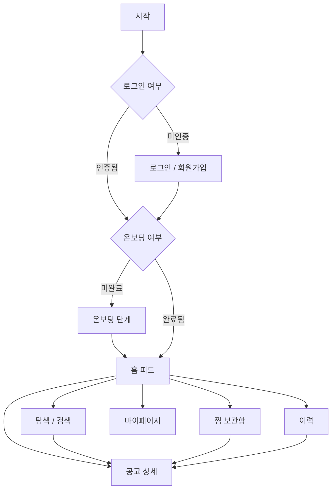

# 🧑‍🎄 FitMe Frontend

> **대학생 맞춤형 장학금 · 공모전 매칭 서비스 — FitMe 프론트엔드 레포지토리입니다.**

흩어져 있는 장학금·공모전 정보를 한곳에 모으고, 사용자의 **거주지역 · 소속대학 · 학점 · 소득구간 · 관심분야**를 기반으로 맞춤 공고를 추천합니다. 관심 공고를 찜하고, 지원 이력을 상태별로 관리하며, 마감 임박 알림을 받아볼 수 있습니다.

🔗 **배포 링크**: https://fit-me-front-smoky.vercel.app

<br />

## 🛠 기술 스택


| 구분 | 사용 기술 | 선택 이유 |
| :--- | :--- | :--- |
| 코어 | React 19, TypeScript, Vite | 타입 안정성 확보 및 빠른 개발 서버·빌드 |
| 스타일링 | Tailwind CSS v4 | 디자인 시안 기반 UI를 빠르게 구성, 클래스 단위 일관성 유지 |
| 서버 상태 | TanStack Query | 캐싱·동기화·로딩/에러 상태를 표준화하여 관리 |
| 클라이언트 상태 | Zustand | 최소한의 보일러플레이트로 인증·모달·토스트 전역 상태 관리 |
| 네트워크 | axios | 인터셉터 기반 토큰 자동 주입 및 401 재발급 처리 |
| 라우팅 | react-router-dom | 인증 상태 기반 라우트 가드 구성 |
| 폼 | react-hook-form + Zod | 스키마 기반 유효성 검증과 실시간 에러 피드백 |
| 배포 | Vercel | main 브랜치 자동 배포 |

<br />

## ✨ 주요 기능

### 인증
- **이메일 회원가입**: 이름·생년월일·이메일 인증번호·비밀번호 검증(react-hook-form + Zod), 이용약관·개인정보처리방침 동의
- **소셜 로그인**: 카카오 · 네이버 (백엔드 주도 OAuth, 콜백에서 토큰 수신 후 저장)
- **계정 연동**: 이미 이메일로 가입된 주소로 소셜 로그인 시, 연동 확인 후 기존 계정과 통합
- **로그인 상태 유지**: 새로고침 후에도 세션 유지
- **토큰 자동 재발급**: Access Token 만료 시 Refresh Token으로 재발급 후 원래 요청 자동 재시도

### 온보딩
- 거주지역(전국 시·군·구 검색), 소속대학(전국 대학·캠퍼스 검색), 학점, 소득구간, 관심분야를 단계별로 입력
- 입력 정보를 기반으로 맞춤 공고 추천에 활용

### 공고 발견
- **홈 피드**: 실시간 인기 공고, 최근 조회 공고, 마감 임박 공고(장학금/공모전 탭)
- **공고 상세**: 요약 정보, 접수·혜택·자격 탭, 원본 링크 이동, 지원 완료 처리
- **찜**: 하트 토글 시 즉시 반영(낙관적 업데이트), 실패 시 이전 상태로 복구

### 탐색 · 개인 기록
- **탐색**: 키워드 검색(입력 디바운스), 카테고리·정렬 필터, 무한 스크롤
- **지원 이력**: 결과 대기 / 최종 합격 탭, 상태 변경, 메모 자동 저장
- **마이페이지**: 프로필·활동 요약, 핏 프로필 수정, 프로필 이미지 업로드, 알림 설정, 공지사항, FAQ·1:1 문의, 회원 탈퇴
- **알림**: 마감 임박 알림 목록 및 미읽음 배지

<br />

## 📚 UMC 워크북 개념 적용

워크북에서 학습한 개념을 실제 서비스에 어떻게 적용했는지 정리했습니다.

| 주차 | 학습 개념 | 적용 위치 | 적용 내용 |
| :--- | :--- | :--- | :--- |
| 1~2주차 | 컴포넌트 기반 설계 · 제어 컴포넌트 · useState | `shared/components/Button·Input·Chip·Dropdown` | 하나의 컴포넌트를 `variant`·`size` props로 변형해 전 화면에서 재사용. 입력값은 모두 제어 컴포넌트로 관리 |
| 2~3주차 | 조건부 렌더링 · TypeScript props 타입 | `BottomSheet`, `Input`, `Modal` | `if (!isOpen) return null` 형태의 early return, 에러 상태에 따른 조건부 스타일링, 모든 컴포넌트 props 인터페이스 정의 |
| 4주차 | react-hook-form + Zod (`zodResolver`, `refine`) | `pages/SignupPage.tsx`, `shared/utils/validation.ts` | 스키마 기반 유효성 검증, `refine`으로 비밀번호 일치 여부 검증, `mode: 'onChange'`로 실시간 에러 표시 |
| 5주차 | react-router 라우팅 · Protected Route · axios 인터셉터 | `routes/router.tsx`, `routes/ProtectedRoute.tsx`, `apis/axiosInstance.ts` | `createBrowserRouter`로 라우팅 구성, 인증 상태에 따른 3단계 라우트 가드, 요청 인터셉터로 토큰 자동 주입 |
| 6주차 | TanStack Query · 서버 상태 · 캐시 정책 · Mock→API 전환 | `lib/queryClient.ts`, `apis/*.ts` | `staleTime` 1분 / `gcTime` 5분 정책 설정, 데이터 요청을 API 함수로 격리해 컴포넌트 수정 없이 Mock→실제 API 교체 |
| 6주차 | `useIntersectionObserver` 무한 스크롤 | `shared/hooks/useIntersectionObserver.ts`, `pages/ExplorePage.tsx` | 목록 바닥 감지 후 `useInfiniteQuery`로 다음 페이지 요청. 요청 진행 중에는 옵저버를 비활성화해 중복 호출 방지 |
| 7주차 | `useMutation` · 낙관적 업데이트 · 롤백 | `shared/hooks/useToggleSave.ts` | 찜 토글 시 서버 응답 전 UI를 먼저 갱신하고, 관련 캐시를 함께 동기화. 실패 시 저장해 둔 스냅샷으로 롤백 후 토스트 안내 |
| 8주차 | `useDebounce` 커스텀 훅 | `shared/hooks/useDebounce.ts`, `shared/components/SearchBar.tsx` | 검색어 입력이 멈춘 뒤 요청이 나가도록 지연시켜 불필요한 API 호출 최소화 |
| 9주차 | Zustand 전역 상태 관리 | `store/authStore.ts`, `modalStore.ts`, `toastStore.ts` | 인증 정보·모달·토스트를 역할별 스토어로 분리. `alert` 대신 전역 토스트/모달로 피드백 일원화 |

### 워크북 개념을 확장한 부분

| 항목 | 내용 |
| :--- | :--- |
| 401 자동 재발급 (single-flight) | 워크북의 axios 인터셉터 개념을 확장해, 동시에 여러 요청이 만료되어도 재발급은 한 번만 실행되도록 처리하고 무한 재시도를 차단했습니다. |
| 소셜 로그인 · 계정 연동 | 백엔드 주도 OAuth 흐름에 맞춰 리다이렉트 및 콜백 파싱을 구현하고, 이메일 중복 시 계정 연동 흐름을 추가했습니다. |
| 로그인 상태 유지 | Zustand `persist`를 적용해 새로고침 후에도 세션이 유지되도록 했습니다. |

<br />

## 🧩 아키텍처 및 구현 포인트

### 상태 관리 분리
서버에서 받아오는 데이터와 앱 자체의 UI 상태를 성격에 따라 분리해 관리합니다.

- **서버 상태 — TanStack Query**: `staleTime` 1분, `gcTime` 5분, `retry` 1회로 캐시 정책을 통일해 불필요한 재요청을 줄였습니다. 조회는 `useQuery`, 변경은 `useMutation`, 무한 스크롤은 `useInfiniteQuery`를 사용합니다.
- **클라이언트 상태 — Zustand**: `authStore`(토큰·온보딩 여부·사용자 이름), `modalStore`, `toastStore`로 역할을 나눴습니다.

### 라우트 가드 (3단계 분기)
`ProtectedRoute`에서 인증 상태에 따라 접근을 제어합니다.

| 조건 | 처리 |
| :--- | :--- |
| 토큰 없음 | `/login`으로 리다이렉트 |
| 토큰 있음 + 온보딩 미완료 | `/onboarding`으로 리다이렉트 |
| 토큰 있음 + 온보딩 완료 | 요청 화면 렌더 |

### axios 인터셉터
- **요청**: 저장된 Access Token을 `Authorization: Bearer` 헤더에 자동 주입
- **응답**: 401(또는 토큰 만료 코드) 감지 시 Refresh Token으로 재발급 후 원요청 재시도
  - 여러 요청이 동시에 만료되어도 재발급은 **한 번만** 실행되도록 처리(single-flight)
  - 재시도한 요청이 다시 실패할 경우를 대비해 플래그로 무한 루프 차단
  - 재발급 실패 시 로그아웃 처리 후 로그인 화면으로 유도

### Mock → API 전환 구조
데이터 요청을 `apis/*.ts`로 격리해, 백엔드 연동 시 **컴포넌트 수정 없이 API 함수 내부만 교체**하면 되도록 설계했습니다. 응답 공통 래핑 `{ isSuccess, code, message, result }`에서 `result`만 반환합니다.

### 낙관적 업데이트
찜 토글은 서버 응답을 기다리지 않고 UI를 먼저 갱신하며, 관련된 여러 쿼리 캐시를 함께 동기화합니다. 요청이 실패하면 저장해 둔 이전 상태로 롤백하고 사용자에게 토스트로 알립니다.

<br />

## 📂 폴더 구조

```text
src/
 ├ apis/          # 도메인별 API 함수 (auth, posting, history, mypage, explore ...)
 │  └ axiosInstance.ts   # baseURL · 토큰 주입 · 401 재발급 인터셉터
 ├ assets/        # 아이콘, 일러스트, 로고
 ├ constants/     # 지역/대학/약관 등 정적 데이터
 ├ features/      # 도메인 단위 화면
 │  ├ history/
 │  ├ mypage/
 │  └ notification/
 ├ lib/           # queryClient 등 라이브러리 설정
 ├ pages/         # 라우트 단위 페이지
 ├ routes/        # router, ProtectedRoute
 ├ shared/
 │  ├ components/ # 공통 UI 컴포넌트 (Button, Input, Modal, PostingCard ...)
 │  ├ hooks/      # useDebounce, useIntersectionObserver, useToggleSave
 │  ├ layouts/    # AuthLayout
 │  └ utils/      # date, file, validation
 ├ store/         # authStore, modalStore, toastStore
 └ types/         # 도메인별 타입 정의
```

<br />

## 📱 화면 목록

| 구분 | 화면 | 경로 | 주요 기능 |
| :--- | :--- | :--- | :--- |
| 인증 | 소셜 로그인 | `/login` | 카카오·네이버·이메일 로그인 진입 |
| 인증 | 이메일 로그인 | `/login/email` | 이메일·비밀번호 로그인 |
| 인증 | 회원가입 | `/signup` | 유효성 검증, 이메일 인증, 약관 동의 |
| 인증 | 온보딩 | `/onboarding` | 거주지·대학·학점·소득·관심분야 입력 |
| 인증 | OAuth 콜백 | `/oauth2/callback` | 소셜 로그인 결과 처리 |
| 공고 | 홈 피드 | `/` | 인기·최근 조회·마감 임박 공고 |
| 공고 | 공고 상세 | `/postings/:postingId` | 상세 정보, 지원·찜 |
| 공고 | 최근 본 공고 | `/recent-postings` | 최근 조회 목록 |
| 탐색 | 탐색 | `/explore` | 검색·필터·정렬, 무한 스크롤 |
| 개인화 | 찜 목록 | `/saved` | 찜한 공고 관리 |
| 개인화 | 이력 목록 | `/history` | 지원 이력, 상태 변경 |
| 개인화 | 이력 상세 | `/history/:id` | 이력 상세, 메모 저장 |
| 개인화 | 알림 | `/notifications` | 마감 임박 알림 |
| 마이 | 마이페이지 | `/my` | 프로필·활동 요약 |
| 마이 | 프로필 수정 | `/my/profile` | 핏 프로필·이미지 수정 |
| 마이 | 알림 설정 | `/my/notifications` | 알림 수신 설정 |
| 마이 | 고객센터 | `/my/support` | FAQ, 1:1 문의 |
| 마이 | 공지사항 | `/my/notices` | 공지 목록 |

### 페이지 이동 흐름 (Flow)



<br />

## 🚀 실행 방법

### 요구 사항
- Node.js 20 이상
- pnpm

### 1. 의존성 설치

```bash
pnpm install
```

### 2. 환경 변수 설정

프로젝트 루트에 `.env` 파일을 생성합니다. (`.env`는 gitignore 대상이며, 배포 환경에는 Vercel 환경 변수로 별도 등록합니다.)

```bash
VITE_API_BASE_URL=https://api.fit-me.site
```

> ⚠️ 이 값이 없으면 API 요청이 백엔드가 아닌 실행 도메인으로 전송되어 정상 동작하지 않습니다.

### 3. 개발 서버 실행

```bash
pnpm dev          # http://localhost:5173
```

### 4. 빌드 및 미리보기

```bash
pnpm build        # 타입 체크 + 프로덕션 빌드 (PR 전 필수)
pnpm preview      # 빌드 결과물 로컬 확인
```

### 5. 코드 스타일 검사

```bash
pnpm lint         # ESLint 검사
pnpm format       # Prettier 포맷팅 자동 적용
```

> 소셜 로그인은 백엔드에 등록된 리다이렉트 URI가 배포 주소 기준이므로, **배포 환경에서 테스트**해야 정상 동작합니다.

<br />

## 🌿 브랜치 및 협업 전략

### 브랜치 전략
- **`main`**: 프로덕션 배포 브랜치. `develop`에서만 병합하며, 병합 시 Vercel 자동 배포가 실행됩니다.
- **`develop`**: 개발 통합 브랜치. PR을 통해서만 병합 가능.
- **`feature/기능명`**: 기능 개발 브랜치. (`develop`에서 분기)
  - _e.g: `feature/login`, `feature/posting-list`_
- **`fix/...`, `hotfix/...`**: 버그 수정 및 긴급 수정 브랜치

### 커밋 메시지 규칙
커밋 메시지는 `타입: 메시지 내용` 형식을 준수합니다.

| 타입 | 설명 |
| :--- | :--- |
| `feat` | 새로운 기능 추가 |
| `fix` | 버그 수정 |
| `docs` | 문서 수정 |
| `style` | 코드 포맷팅, 세미콜론 누락 등 |
| `refactor` | 프로덕션 코드 리팩토링 |
| `test` | 테스트 코드 추가 및 수정 |
| `chore` | 빌드 업무, 패키지 매니저 설정 등 |

### Pull Request (PR) 및 코드 리뷰 컨벤션
- `feature/기능명` 브랜치에서 작업 완료 후 `develop` 브랜치로 PR을 보냅니다.
- 최소 **1명 이상의 팀원 승인**을 받아야 `develop`에 병합할 수 있습니다.
- **PR 전 `pnpm build` 통과는 필수**입니다. (타입 에러로 인한 배포 실패 방지)
- 패키지가 추가/변경된 경우 PR 내용에 명시하고 팀에 공지합니다.
- 병합은 한 번에 하나씩 진행하고, 병합 후 팀 채널에 공유합니다.

<br />

## 👥 팀원 및 역할 분담

| 이름 | 역할 | 담당 기능 |
| :--- | :--- | :--- |
| **[서은호](https://github.com/eunho0216)** | 앱 골격 · 인증 (파트장) | 로그인·회원가입·온보딩, 소셜 로그인 및 계정 연동, 라우터·라우트 가드, axios 인터셉터·토큰 재발급, 전역 상태 설계, 배포 |
| **[김경섭](https://github.com/kimgs1107)** | 공고 발견 흐름 | 홈 피드, 공고 상세, 찜 목록·낙관적 업데이트, 최근 본 공고 |
| **[정종욱](https://github.com/Beuja)** | 탐색 · 개인 기록 | 검색·필터·무한 스크롤, 지원 이력 관리, 마이페이지·프로필 설정, 알림·공지·고객센터 |
